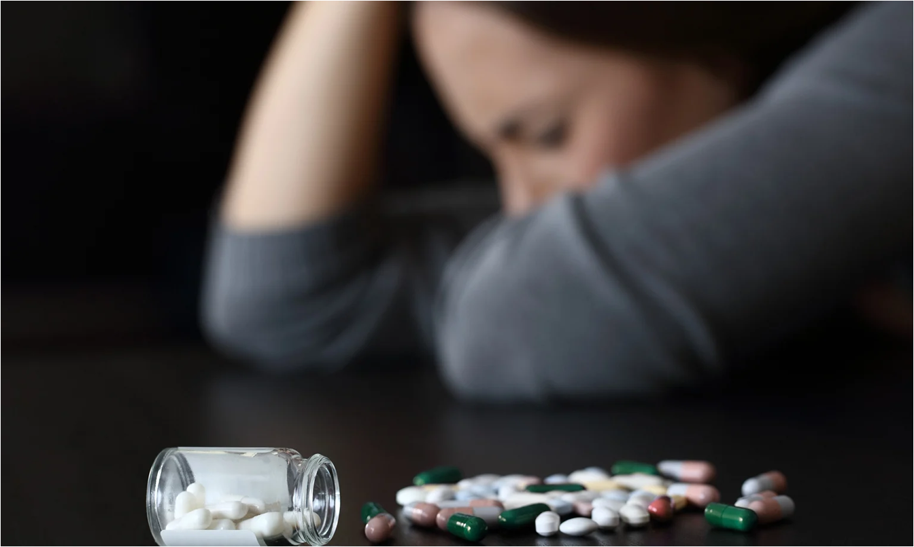

---
{}
---

**Your road to recovery begins here...**

We help provide access to personal development and community resources to aid in the journey of recovery as well as being there at the push of a button when needed. There is no reason that millions of patients should go without treatment or feel alone through their recovery periods.

---
{}
---

**Our Mission**

*We help adults affected by Substance Use Disorder find resources by providing a customizable filter for the most ideal location that fits the customer's needs.*

{width="417" height="285"}

---
{}
---

Substance Use Disorders (SUD) have impacted an alarming amount of individuals' lives by significantly impairing them from meeting major responsibilities including work, school, and home.

In 2019, 21.6 million people needed treatment, but just 2.6 million received any.

Discover our [resources](/resources).

Contact us by [email](mailto:admin@sudrasupport.com).
